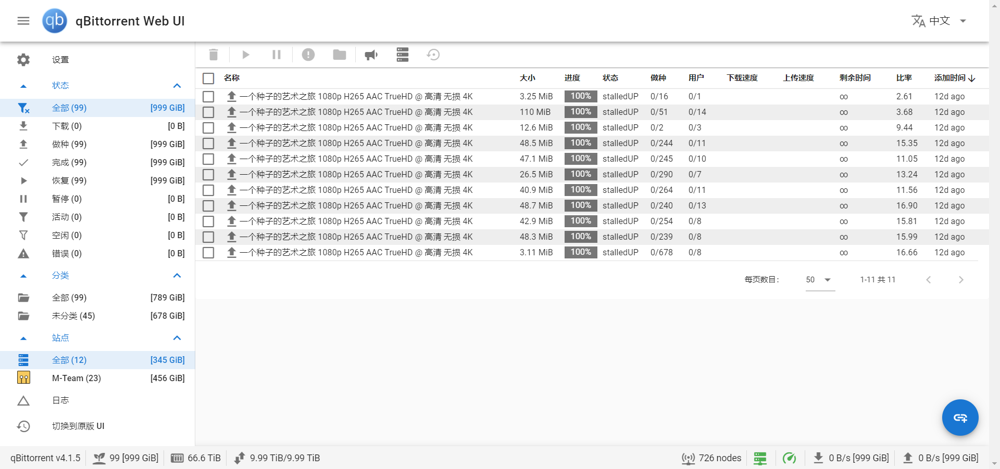
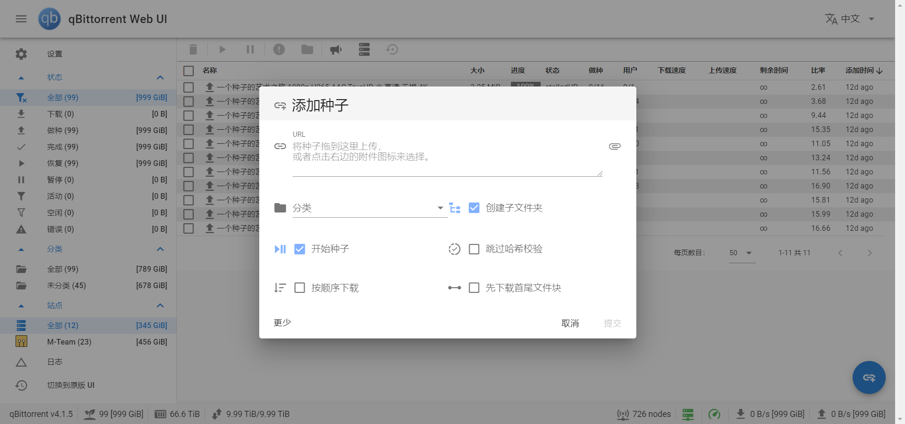
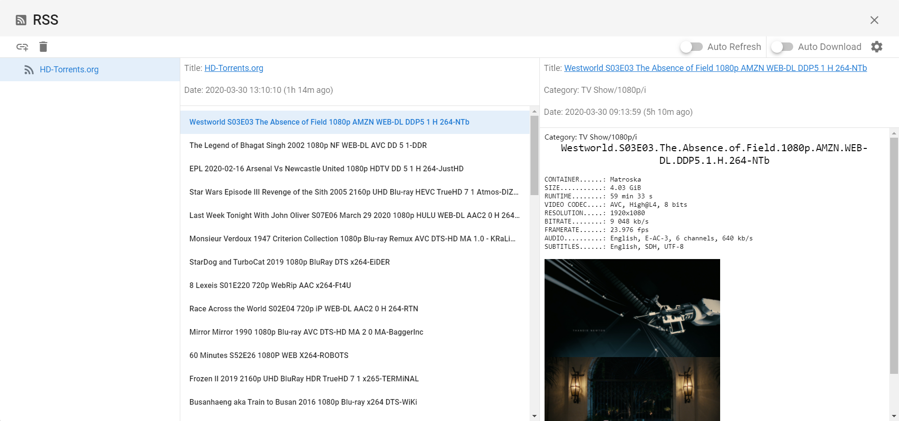
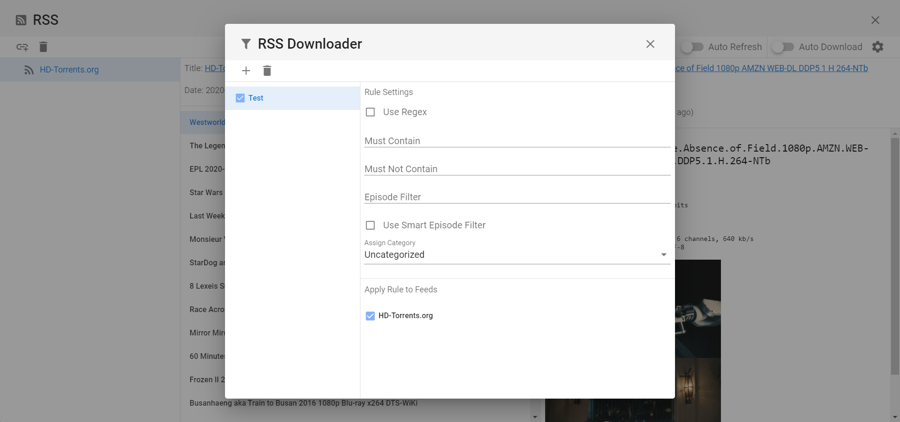

# qb-web
## Info

## Features
Keywords: SPA, RSS, Search, Responsive Design, Modern Design, i18n

Languages: English, 中文

TODO:
 - [ ] Settings UI

## Download

[Releases](https://github.com/CzBiX/qb-web/releases/latest)

## Install

see: [INSTALL.md](./INSTALL.md)

## Wiki

[Use Nginx to running multi WebUI at the same time](https://github.com/CzBiX/qb-web/wiki/Use-Nginx-to-running-multi-WebUI-at-the-same-time)

## Screenshot

